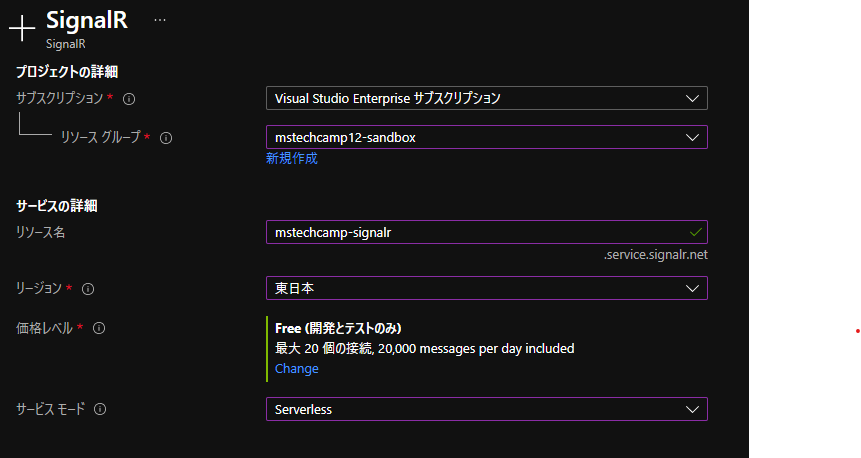
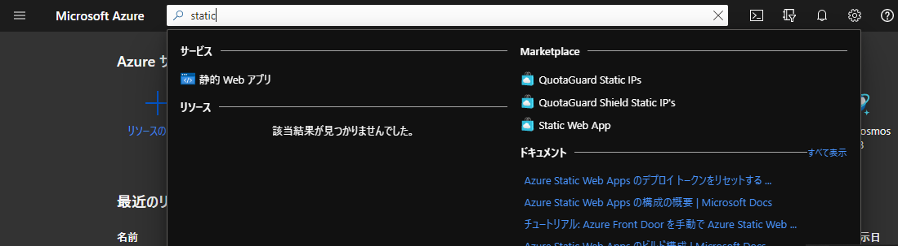
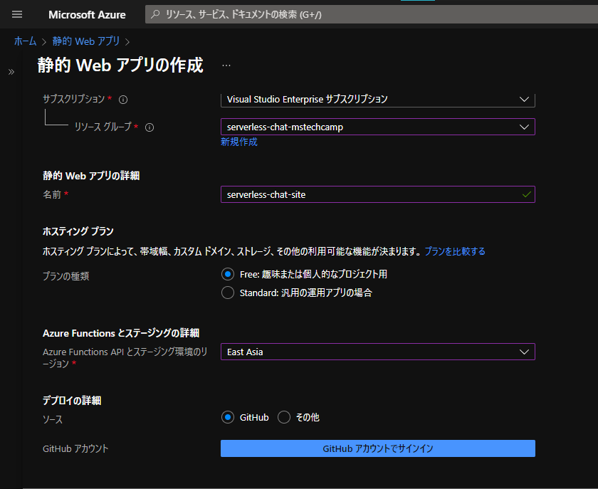
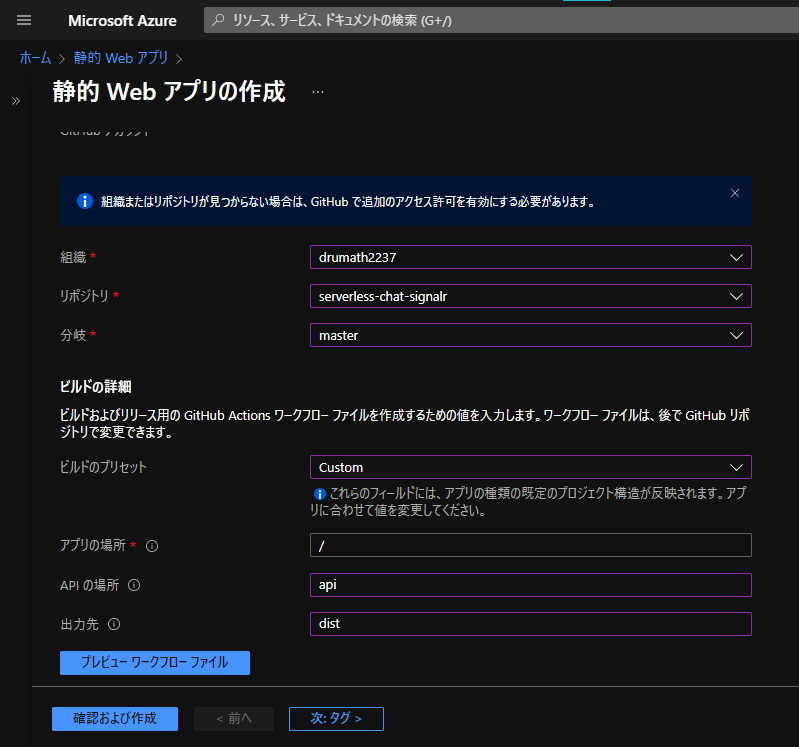
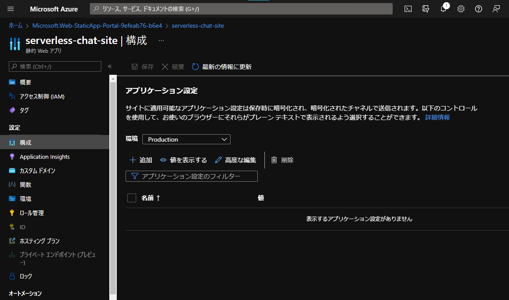
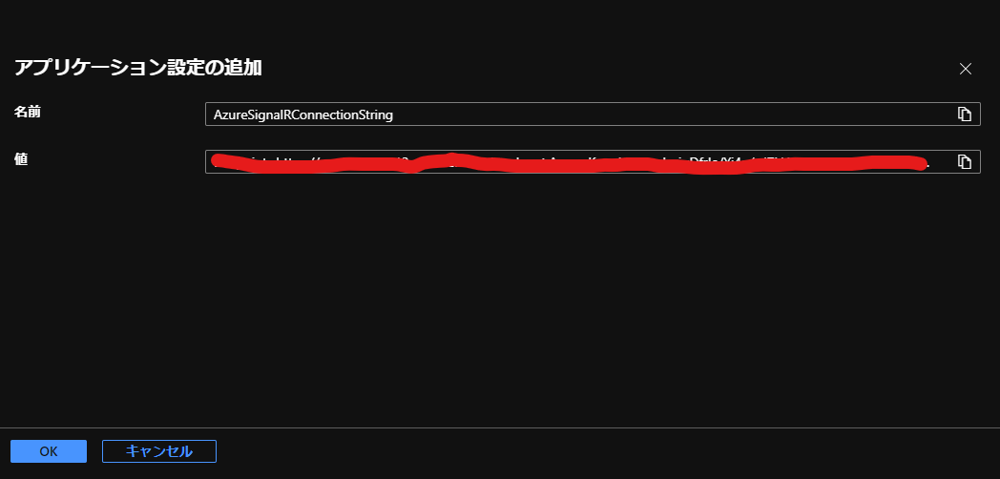
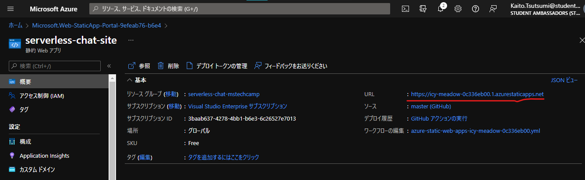
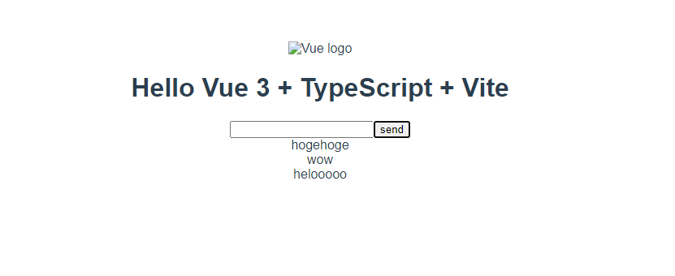

# MS Tech Camp #12 SignalRとStatic Web Appsでサーバレスチャット開発ライブデモ

## 概要

## 環境

- Windows 10 Home
- VSCode
- Azure Functions Core Tools v4
- yarn
- Node.js v14
- Vue.js 3

## 手順

### Azure SignalR Serviceリソースの作成



### ローカルプロジェクトの初期化

<!-- viteコマンドを使ってプロジェクトを作成 -->
<!-- yarn devで起動確認 -->

まずは任意のディレクトリでターミナルを開き、
次のコマンドを実行します。

```
yarn create vite serverless-chat-signalr --template vue-ts
```

`yarn create vite <app-name>`とすることで
Viteのプロジェクトが初期化されます。
オプションで`vue-ts`
というテンプレートを指定するとTypeScriptでVue3を使った
プロジェクトが選択されます。

そのあと以下のコマンドで

1. ディレクトリを移動
2. 依存パッケージのインストール
3. devサーバの起動

を行います。

```sh
cd serverless-chat-signalr

yarn

yarn dev
```

`localhost:3000`にアクセスして次のような画面が出れば成功です。
画面が見えたらいったんdevサーバを`Ctrl+C`で落としましょう。

### CLIを使ったStatic Web Appsのエミュレーション

<!-- CLIでyarn devの挙動を確認 -->

続いてStatic Web Apps CLI（以下SWA CLI）
によるエミュレーションを行います。

次のコマンドでSWA CLIをインストールしましょう。
自分はローカル環境が汚れるのが嫌なのでプロジェクトにインストールしていますが
グルーバルインストールをするのが一般的なようです。

```sh
yarn add -D @azure/static-web-apps-cli
```

そして先ほど立ち上げたdevサーバを今度は
SWA CLIでエミュレーションしながら立ち挙げてみます。

```sh
yarn swa start http://localhost:3000 --run "yarn dev"
```

ここのコマンドはサーバをSWAにデプロイしたかのようにエミュレーション
させるためのコマンドです。
devサーバを立ち上げた状態でエミュレーションしてもよいのですが、
今回はrunオプションによってサーバの立ち上げも同時にやっています。

コマンドを実行するとログが一気に流れてきますが、
`localhost://4280`にアクセスして先ほど同様の画面が表示されれば
成功です。
そしてまたdevサーバを落としましょう。

### Azure Functionsの作成とエミュレーション

<!-- `/api/hello`を作って通信を確認 -->

先ほど初期化したプロジェクトにAzure Functionsを
追加していきましょう。
プロジェクトルートに`/api/`というフォルダを作成し、
そこにAzure Functions拡張機能でFunctionsを初期化します。
この時プロジェクトルートで初期化しないように気を付けてください。

初期化出来たら試しにHTTPトリガー関数を追加してみます。
今回はTypeScriptで`/api/hello`というエンドポイントに作成します。

関数を作成すると、`@azure/functions`パッケージがないので、
`/api`にパッケージをインストールしましょう。
AzureFunctionsは一律npmなので、ここではnpmを使います。

```sh
cd api
npm install
```

現時点ではこのような画面になってるのではないでしょうか。
<!-- vscodeの画像がここに -->

`/api/hello/index.ts`を編集して、
任意のリクエストに対して
`{text:hello}`というJSONを返すAPIにして見ます。

```ts :index.ts
import { AzureFunction, Context, HttpRequest } from "@azure/functions";

const httpTrigger: AzureFunction = async function (
  context: Context,
  req: HttpRequest
): Promise<void> {
  context.res = {
    // status: 200, /* Defaults to 200 */
    body: JSON.stringify({
      text: "hellooooo",
    }),
  };
};

export default httpTrigger;
```

作成した関数をテストするために、
プロジェクトルートの`package.json`に起動スクリプトを追加しましょう。

```json :package.json
// ...
"scripts": {
  // ...
  "start:api": "cd api && npm run start"
},
// ...
```

そしてターミナルで次のコマンドを実行したのちに、
ブラウザで`localhost:7071/api/hello`にアクセスすると、無事Functionsが
動いているのが確認できます。
この関数は起動したままにしておきましょう。

<!-- ここに画像 -->

それでは関数もSWA CLIでエミュレートしてみましょう。
また`package.json`に起動スクリプトを作成します。

```json :package.json
"scripts": {
  "start:api": "cd api && npm run start", // 先ほど追加したスクリプト
  "start:swa": "swa start http://localhost:3000 --run \"yarn dev\" --api-location /api"
}
```

それではターミナルで次のコマンドを実行して
SWAのAPI統合をエミュレートします。

```
yarn start:swa
```

`localhost:4280/api/hello`にアクセスすると、
AzureFunctionsの関数にプロキシが設定されて
実行されました。
これでWebクライアントから`fetch('/api')`等でアクセスできます。
一回試してみましょう。

`/src/components/HelloWorld.vue`を次のように書き換えます。

```vue :HelloWorld.vue
<script setup lang="ts">
import { ref } from "vue";

defineProps<{ msg: string }>();

const hello = ref("");

fetch("/api/hello")
  .then((res) => res.json())
  .then((data) => (hello.value = data.text));
</script>

<template>
  <h1>{{ msg }}</h1>
  <p>{{ hello }}</p>
</template>
```

SWA CLIでエミュレートされている間はホットリロードが有効なので
ファイルを保存すれば即時に結果がは反映されているはずです。
次のような画面が表示されていれば成功でしょう。

<!-- ここに画像 -->

### SignalR Service関連のAzure Functionsを作成

<!-- `/api/negotiate`と`/api/sendMessage`を作る -->

続いて、また/api以下を触りながら
SignalRの関数を作成します。

SignalRで通信するためには
クライアントとサーバ間でコネクションを張る必要があり、
まずはその接続情報を提供するAPIを作成します。

vscodeのコマンドパレットでsignalrと検索すると
negotiate関数を作成するオプションが出てきます。
出てこない場合には一番下の
change template filterでAllを選択すると出てきます。
実行すると自動でコードが追加されますが、
接続情報がまだないので動作しません。
`/api/negotiate/local.settings.json`の中に
Azure Portalから取得できる接続文字列を追記しましょう。

<!-- ここに画像 -->

```json :local.settings.json
{
  "IsEncrypted": false,
  "Values": {
    "AzureWebJobsStorage": "",
    "FUNCTIONS_WORKER_RUNTIME": "node",
    "AzureSignalRConnectionString": "<接続文字列>" // ここを追加
  }
}
```

Azure Functionsを再起動すると
`/negotiate`エンドポイントが追加されているはずです。

次にPOSTリクエストに応じて
SignalRクライアントに通知を送るHTTPトリガーを作成しましょう。

HTTPトリガー関数を追加して、`sendMessage`という名前にします。
作成出来たら`/api/sendMessage/function.json`というファイルができているはずなので、
こちらにSignalRの出力バインディングを追加します。
できればhttpリクエストはPOSTだけ受け付けるようにしておくのがベターでしょう。

```json :function.json
{
  "bindings": [
    {
      "authLevel": "anonymous",
      "type": "httpTrigger",
      "direction": "in",
      "name": "req",
      "methods": ["post"]
    },
    {
      "type": "http",
      "direction": "out",
      "name": "res"
    },
    {
      // ここからを追加
      "type": "signalR",
      "name": "signalRMessages",
      "hubName": "default",
      "connectionStringSetting": "AzureSignalRConnectionString",
      "direction": "out"
    }
  ],
  "scriptFile": "../dist/sendMessage/index.js"
}
```

次に`/api/sendMessage/index.ts`を編集して、
次のようにします。

```ts :index.ts
import { AzureFunction, Context, HttpRequest } from "@azure/functions";

const httpTrigger: AzureFunction = async function (
  context: Context,
  req: HttpRequest
): Promise<void> {
  if (req.body.text) {
    context.bindings.signalRMessages = [
      {
        target: "newMessage",
        arguments: [req.body.text],
      },
    ];
  }
  context.done();
};

export default httpTrigger;
```

この関数ではbodyに`{text:xxx}`があるかどうかのバリデーションを設けているので
クライアントでPOSTするときはこの仕様を守るようにします。

ここまで作ってまたFunctionsを起動してみると、
`sendMessage`APIが追加されているのがわかります。

### SignalR クライアントの実装

<!-- `@microsoft/signalr`を用いてメッセージ受信 -->

SignalRを使った通信をWebクライアントで実装する場合、
`@microsoft/signalr`というnpmパッケージを使います。
まずはこれをインストールしましょう。

```sh
yarn add @microsoft/signalr
```

そしてWebクライアントの実装をしていきます。
UIなどの実装はお好きなように実装して構いませんので
一例をお見せする感じにします。

まずは`/src/components/HelloWorld.vue`
を編集して次のようにします。

```vue HelloWorld.vue
<script setup lang="ts">
import { ref } from "vue";
import { HubConnectionBuilder } from "@microsoft/signalr";
import { useMessages } from "../composables/useMessages";

defineProps<{ msg: string }>();

const txtMessage = ref("");

const { pushMessage, reversedMessages } = useMessages();

// signalr settings
const connection = new HubConnectionBuilder().withUrl("/api").build();
connection.start().then(() => {
  connection.on("newMessage", (newMessage: string) => {
    pushMessage(newMessage);
  });
});

const onClick = () => {
  fetch("/api/sendMessage", {
    method: "POST",
    body: JSON.stringify({
      text: txtMessage.value,
    }),
  });
  txtMessage.value = "";
};
</script>

<template>
  <h1>{{ msg }}</h1>

  <div>
    <div>
      <input
        type="text"
        name="txtMessage"
        id="txtMessage"
        v-model="txtMessage"
      />
      <input type="button" value="send" @click="onClick" />
    </div>

    <div id="messagesWrapper">
      <div v-for="(message, index) in reversedMessages" :key="index">
        {{ message }}
      </div>
    </div>
  </div>
</template>
```

scriptタグの中では、

- SignalRの設定
- sendMessageへリクエストを送信するコールバック

の二つを実装しています。
またmessageに関しては、`/src/composables/useMessages.ts`
にロジックを分けています。

```ts :useMessages
import { computed, reactive } from "vue";

export const useMessages = () => {
  const messages = reactive<string[]>([]);

  const reversedMessages = computed(() => messages.slice().reverse());

  const pushMessage = (msg: string) => {
    messages.push(msg);
  };

  return {
    reversedMessages,
    pushMessage,
  };
};
```

さて実装ができたら動かしてみましょう。
インプットボックスに文字を打って、sendボタンを押すとメッセージを送信できます。
タブを2個開いて確認するとわかりやすいでしょう。

<!-- ここに画像 -->

### Azure Static Web Appsにデプロイ

<!-- SWAへのデプロイ -->

最後にAzure SWAへデプロイしましょう。
ここでは次のようなことをします。

1. GitHubへpush
2. Azure SWAリソースの作成
3. 接続文字列の設定

まずは現状のコードを丸々GitHubの任意のリポジトリにpushします。
リポジトリはPrivateでも問題ないです。

続いてAzure PortalでSWAのリソースを
作成しましょう。
検索バーで「static」と検索すると
静的Webアプリと出てきますので、こちらのリソースを作成します。



他のリソースと同様、
リソースグループやリソース名の設定などを行っていきます。
リージョンはなるべく近い場所を選択するといいと思います。
東日本リージョンはまだないみたいですね。



SWAではコンテンツのデプロイをGitHubを使って行います。
デプロイの詳細でGitHubアカウントの認証を行うと、
リポジトリの指定ができるので、各種設定を済ませましょう。

また、ビルドの詳細に関してはプリセットを使わずにカスタムを選択して、
APIの場所やビルド成果物の場所を指定します。



ここまでできたら確認と作成を行いましょう。
接続したGitHubリポジトリを確認すると、
AzureからCIの設定ファイルがコミットされており、
ジョブが実行されてSWAにデプロイされていきます。

SWAではデプロイにGitHub Actionsを使用しますが、
そのワークフローは自動生成されるので
CIのことをよく知っていなくてもできますし、
あとでカスタマイズすることも可能です。

それでは最後に、SWAの接続文字列
の設定をします。
これはローカルで作業しているときに扱っていた
`local.settings.json`にSignalRの接続文字列の情報を
デプロイ先にも設定するということです。

SWAの「構成」タブに移動して「追加」ボタンを押します。
そしてその中に接続文字列を設定し、保存ボタンを押します。





さて、これですべての設定が完了しました。
「概要」タブに移動し、URLをクリックしてみましょう。



するとチャットが無事動いているのが確認できます。
（Vueのロゴが表示されていないのは仕様ですので問題ないです）



## 参考資料

- [Azure Functions における SignalR サービスのバインド](https://docs.microsoft.com/ja-jp/azure/azure-functions/functions-bindings-signalr-service)
- [Azure SignalRサービスドキュメント](https://docs.microsoft.com/ja-jp/azure/azure-signalr/signalr-overview)
- [Vite](https://ja.vitejs.dev/)
- [Azure Static Web Apps CLI](https://github.com/Azure/static-web-apps-cli)
